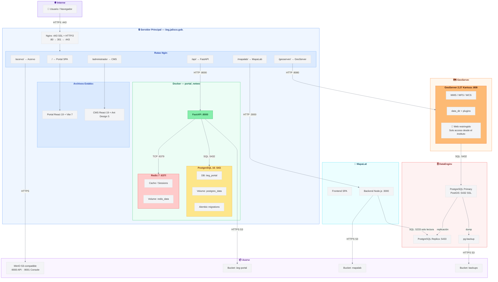

# Arquitectura del Portal IIEG

## Stack Tecnológico

### Portal Web (web/)

| Tecnología | Versión | Uso |
|------------|---------|-----|
| React | 19.2.4 | UI library |
| React Router | 7.13.0 | Routing / SPA navigation |
| Vite | 7.3.1 | Build tool / dev server |
| TailwindCSS | 4.1.18 | Estilos (con @tailwindcss/postcss) |
| Axios | 1.13.3 | HTTP client |
| React GA4 | 2.1.0 | Google Analytics 4 |

### CMS Admin (admin/)

| Tecnología | Versión | Uso |
|------------|---------|-----|
| React | 19.2.4 | UI library |
| React Router | 7.13.0 | Routing / SPA navigation |
| Vite | 7.3.1 | Build tool / dev server |
| Ant Design | 6.2.2 | Componentes UI del panel admin |
| @ant-design/icons | 6.1.0 | Iconografía del CMS |
| Axios | 1.13.3 | HTTP client |
| @dnd-kit | core 6.3 / sortable 10.0 | Drag & drop (ordenamiento de elementos) |
| React GA4 | 2.1.0 | Google Analytics 4 |
| MSW | 2.12.7 | Mock Service Worker (testing) |

### Backend (api/)

| Tecnología | Versión | Uso |
|------------|---------|-----|
| Python | 3.12 | Runtime |
| FastAPI | 0.111–0.112 | Framework API REST |
| Uvicorn | 0.23+ | ASGI server (desarrollo) |
| Gunicorn + Uvicorn workers | 22–23 | ASGI server (producción) |
| SQLAlchemy | 2.0 | ORM |
| Alembic | 1.13 | Migraciones de BD |
| Pydantic / pydantic-settings | 2.5+ | Validación de datos y configuración |
| python-jose | 3.3+ | JWT tokens (autenticación) |
| passlib + bcrypt | 1.7+ / 3.2+ | Hashing de contraseñas |
| Redis (driver) | 5.0+ | Cliente para cache y sesiones |
| MinIO (driver) | 7.2+ | Cliente S3 para Acervo |
| psycopg2-binary | 2.9+ | Driver PostgreSQL |
| python-multipart | 0.0.9+ | Upload de archivos |
| python-dotenv | 1.0+ | Variables de entorno |

### Dev / Testing

| Tecnología | Versión | Uso |
|------------|---------|-----|
| ESLint | 9.39.2 | Linter JS/JSX (web + admin) |
| Ruff | 0.3+ | Linter + formatter Python |
| Pytest | 8.0+ | Testing backend |
| HTTPX | 0.26+ | HTTP client async para tests |
| pytest-asyncio | 0.23+ | Soporte async en tests |
| pytest-cov | 4.1+ | Cobertura de tests |
| Mypy | 1.9+ | Type checking Python |

### Base de Datos

| Tecnología | Versión | Uso |
|------------|---------|-----|
| PostgreSQL | 16 (prod) / 18 (dev) | Base de datos relacional del portal |

### GIS / Geoespacial

| Tecnología | Versión | Uso |
|------------|---------|-----|
| GeoServer | 2.27 Kartoza | Servidor de mapas (WMS/WFS/WCS), proxy vía Nginx |
| PostGIS | — | Extensión geoespacial en DataEngine |

### Infraestructura / DevOps

| Tecnología | Versión | Uso |
|------------|---------|-----|
| Docker | — | Contenedores para todos los servicios |
| Docker Compose | — | Orquestación (2 archivos: dev + prod) |
| Nginx | Alpine | Reverse proxy (producción) + servidor de estáticos |
| Make | — | Automatización de comandos (make up, make build, make clean) |
| Node | 24 Alpine | Imagen base para frontend y CMS |
| Python | 3.12 Slim | Imagen base para backend |

### Arquitectura

- Monorepo con 4 directorios: `web/`, `admin/`, `api/`, `nginx/`
- Red Docker compartida (`portal_network`) para comunicación entre servicios
- Dos modos: desarrollo (Vite dev server + Uvicorn --reload) y producción (Nginx estático + Gunicorn)
- Backend: arquitectura en capas — routes → services → models con schemas Pydantic
- Frontend: estructura por páginas con hooks y contextos compartidos

## Diagrama de Arquitectura



## Estructura del Monorepo

```
portal/
├── backend/              # API FastAPI
│   ├── app/
│   │   ├── api/routes/   # Endpoints
│   │   ├── core/         # Config, security, database
│   │   ├── models/       # SQLAlchemy models
│   │   ├── schemas/      # Pydantic schemas
│   │   └── services/     # Business logic
│   ├── alembic/          # Migraciones DB
│   └── scripts/          # Scripts de utilidad
│
├── frontend/             # Portal público (React)
│   └── frontend/
│       ├── src/
│       │   ├── components/
│       │   ├── pages/
│       │   ├── hooks/
│       │   ├── services/
│       │   └── contexts/
│       └── public/
│
├── cms/                  # CMS Admin (React + Ant Design)
│   └── frontend/
│       ├── src/
│       │   ├── components/
│       │   ├── pages/
│       │   ├── hooks/
│       │   ├── services/
│       │   └── contexts/
│       └── public/
│
└── docs/                 # Documentación adicional
```

## Flujos de Trabajo

### Desarrollo Local

```bash
# Levantar servicios de infraestructura
docker compose -f docker-compose.dev.yml up postgres redis minio -d

# Backend
cd backend && uvicorn app.main:app --reload --port 8000

# Frontend (puerto 3010)
cd frontend && npm run dev

# CMS (puerto 3011)
cd cms && npm run dev
```

### Producción

```bash
docker compose up -d
```

## Puertos

| Servicio | Desarrollo | Producción |
|----------|------------|------------|
| Frontend | 3010 | 80 (nginx) |
| CMS | 3011 | 80 (nginx) |
| Backend | 8000 | 8000 |
| PostgreSQL | 5432 | 5432 |
| Redis | 6379 | 6379 |
| MinIO API | 9000 | 9000 |
| MinIO Console | 9001 | 9001 |

## Documentación Adicional

- [Conexión Frontend-Backend](./FRONTEND_CONNECTION.md)
- [Cookies y CSRF](./COOKIES_CSRF.md)
