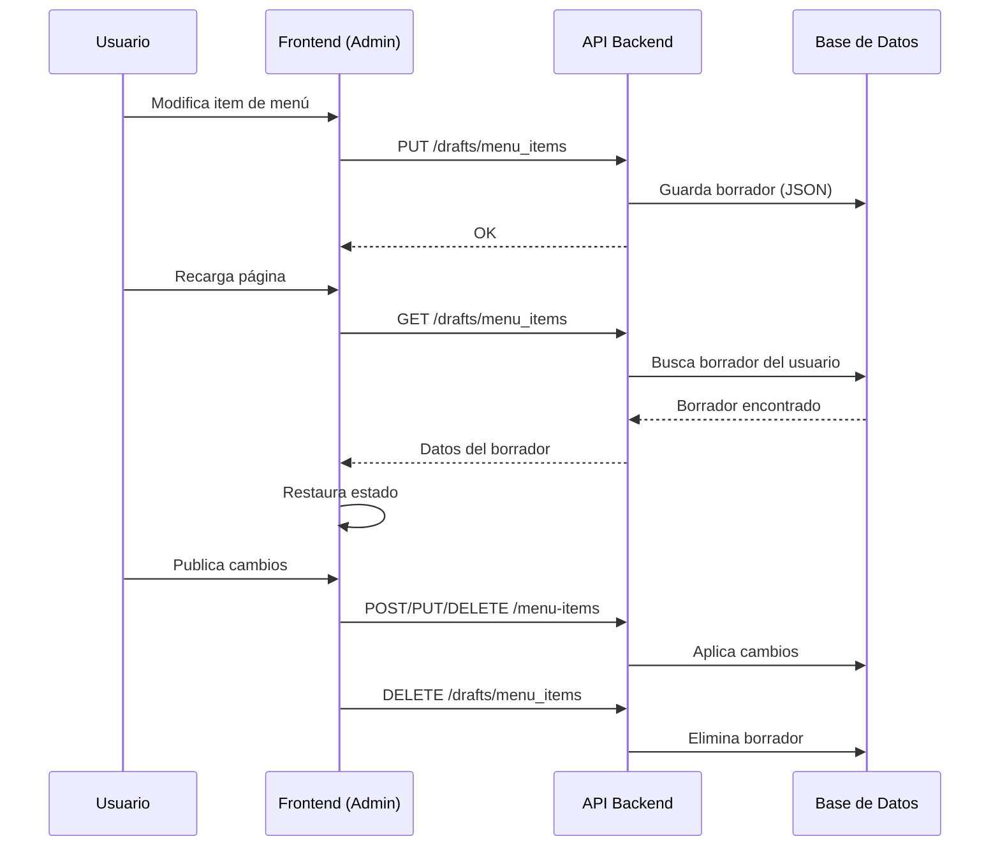
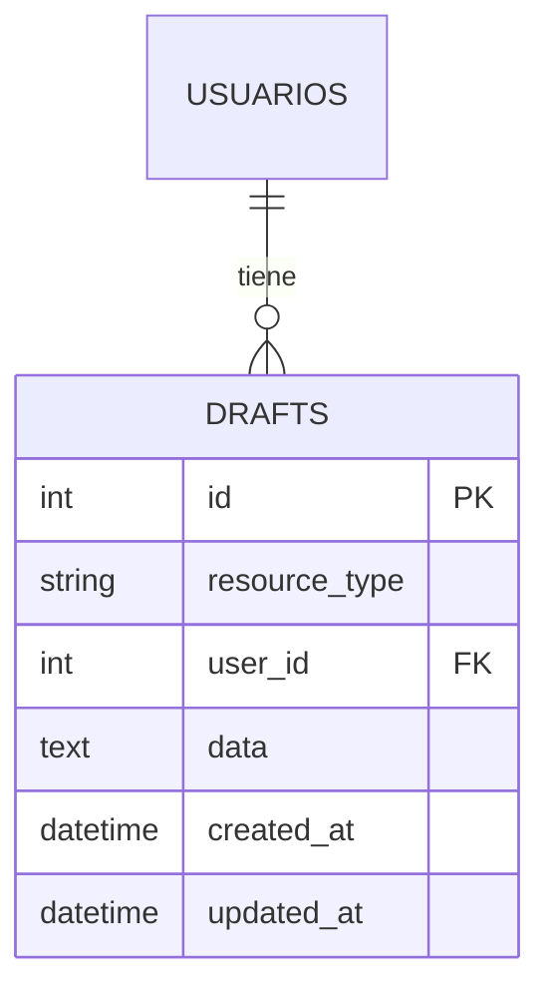

# Sistema de Borradores (Drafts)

## Flujo General



## Modelo de Datos



## Endpoints API

| Método | Endpoint | Descripción |
|--------|----------|-------------|
| `GET` | `/drafts/{resource_type}` | Obtiene borrador del usuario actual |
| `PUT` | `/drafts/{resource_type}` | Guarda/actualiza borrador |
| `DELETE` | `/drafts/{resource_type}` | Elimina borrador |

## Uso en Frontend

```javascript
const RESOURCE_TYPE = 'menu_items';

await api.put(`/drafts/${RESOURCE_TYPE}`, {
    resource_type: RESOURCE_TYPE,
    data: JSON.stringify({ menuItems, nextTempId })
});

const draft = await api.get(`/drafts/${RESOURCE_TYPE}`);
const data = JSON.parse(draft.data);
```

## Resource Types Disponibles

| Tipo | Descripción |
|------|-------------|
| `menu_items` | Borradores del gestor de menú |
| *(futuro)* | Otros módulos pueden usar el mismo sistema |
