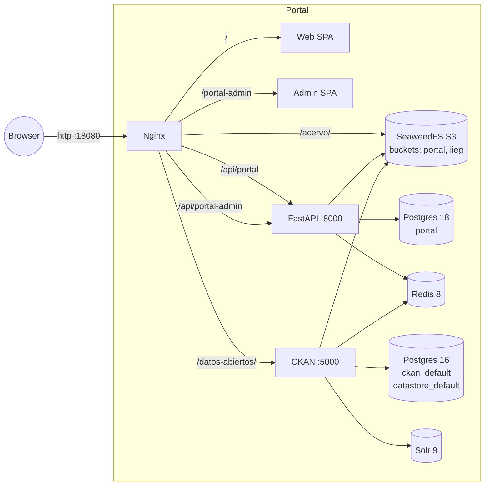

# Infraestructura

## Monorepo

```
sitio2026/
├── web/                   # Portal público (React 19 + Vite 7 + Tailwind 4)
├── admin/                 # CMS (React 19 + Vite 7 + Ant Design 6 + TipTap + dnd-kit)
├── api/                   # FastAPI 0.111 + SQLAlchemy 2 + Alembic + boto3
├── ckan/                  # Dockerfile custom CKAN 2.11.5 + extensiones
├── nginx/                 # Reverse proxy
├── dev-seaweedfs/         # Acervo embebido (solo dev)
├── alembic/               # Migraciones backend
├── docs/                  # Esta documentación
├── docker-compose.yml         # Producción "administración"
├── docker-compose.dev.yml     # Desarrollo
├── docker-compose.gcp.yml     # Overlay producción GCP (iieg-network)
├── Makefile                   # Atajos make up | down | clean | shell-* | setup
├── .env.development.example   # Plantilla dev
└── .env.production.example    # Plantilla prod
```

## Stack

### Backend (`api/`)
- Python 3.12 (slim)
- FastAPI 0.111
- SQLAlchemy 2 + Alembic
- Pydantic v2 + pydantic-settings
- python-jose (JWT), passlib + bcrypt
- psycopg2-binary, redis 5
- boto3 (cliente S3 al Acervo)
- aiosmtplib (form de contacto)
- Servidor: uvicorn `--reload` en dev, gunicorn + uvicorn workers en prod

### Portal web (`web/`)
- React 19, react-router 7
- Vite 7
- Tailwind 4 + `@tailwindcss/typography`
- Axios, swiper, react-paginate, react-helmet-async
- react-ga4, react-gtm-module

### CMS Admin (`admin/`)
- React 19, react-router 7
- Vite 7 con `base: '/portal-admin/'`
- Ant Design 6 + @ant-design/icons
- @dnd-kit (drag & drop menú)
- @tiptap/react (editor rich-text)
- Axios con `withCredentials: true`

### Datos
- PostgreSQL **18-alpine** (portal)
- PostgreSQL **16-alpine** (CKAN) — fijo en 16 por compatibilidad con scripts de CKAN 2.11
- Redis 8-alpine
- Solr 9 (imagen `ckan/ckan-solr:2.11-solr9`)

### CKAN (`ckan/`)
- Base: `ckan/ckan-base:2.11.5` (prod) o `ckan/ckan-dev:2.11.5` (dev, deshabilitado por warnings)
- Dockerfile custom instala via `pip install -e`:
  - `ckanext-xloader` 2.3.0 (carga al DataStore)
  - `ckanext-s3filestore` (Filestore → Acervo)
- Plugins activos por defecto: `envvars image_view text_view datatables_view datastore xloader activity s3filestore`

### Acervo (S3-compatible)
- **dev:** SeaweedFS 4.23 embebido en este compose (`dev-seaweedfs/`).
- **prod:** SeaweedFS externo del repo `/IIEG/acervo/`, accedido via `iieg-network` (GCP) o URL pública (administración).

## Diagrama



## Redes Docker

### Dev (`docker-compose.dev.yml`)
- `portal_network_dev` — todos los servicios del portal + seaweedfs embebido + nginx
- `ckan_network_dev` — ckan, ckan-db, ckan-solr, redis (compartido)
- No requiere redes externas.

### Prod "administración" (`docker-compose.yml`)
- `portal_network` — todo el portal
- `ckan_network` — ckan stack
- El Acervo se accede vía URL pública (no por red Docker).

### Prod GCP (`docker-compose.yml` + `docker-compose.gcp.yml`)
- Igual que admin **+** `iieg-network` (external).
- Aliases declarados: `portal-nginx`, `portal-api`, `portal-ckan` para no colisionar con otros proyectos en `iieg-network` (mariachi, mapalab, etc. también tienen servicios `api`/`nginx`).

## Autenticación del portal

Cookie httpOnly + CSRF (token JWT firmado con clave aparte). Detalle:

1. POST `/api/portal-admin/autenticacion/iniciar-sesion` → setea cookie `access_token` (HttpOnly) y retorna `csrf_token` en JSON.
2. Frontend guarda CSRF en `sessionStorage` (se borra al cerrar tab).
3. Axios inyecta header `X-CSRF-Token` en POST/PUT/PATCH/DELETE.
4. Backend valida cookie y CSRF en métodos mutables (dependency `verify_csrf`).

Roles: `tetlamamakani` (admin total) y `editora` (contenido). Definido en el enum del modelo `Usuario`.

## Rutas nginx (resumen)

| Path | Destino |
|---|---|
| `/` | SPA portal web (estático) |
| `/portal-admin/*` | SPA CMS admin (estático) |
| `/api/*` | FastAPI (upstream `portal-api:8000`) |
| `/datos-abiertos/*` | CKAN (upstream `portal-ckan:5000`) |
| `/datos-abiertos/login`, `/logout`, `/register` | 301 → `/datos-abiertos/user/<x>` |
| `/base/*`, `/webassets/*`, `/_debug_toolbar/*` | CKAN (paths que CKAN genera sin prefix) |
| `/acervo/*` | SeaweedFS upstream (configurable por `ACERVO_UPSTREAM_URL`) |
| `/robots.txt`, `/sitemap.xml` | Estáticos `nginx/static/` |

> Nginx usa templates de `nginx/templates/` que se procesan con `envsubst` al iniciar. Solo se sustituyen vars con prefijo `ACERVO_` (filter declarado en compose).

## Convenciones

- Endpoints en **español** (`autenticacion`, `paginas`, `multimedia`, `borradores`, etc.)
- Modelos SQLAlchemy en español (`Usuario`, `Pagina`, etc.)
- Vite alias: `@components`, `@pages`, `@layouts`, `@providers`, `@services`, `@contexts`, `@hooks`, `@utils`, `@assets`
- ESLint: 4 espacios, comillas simples
- Backend: type hints, PEP 8, `snake_case`, `PascalCase` para clases
- Conventional commits

## Docs relacionadas

- [AMBIENTES.md](./AMBIENTES.md) — comandos make, URLs, troubleshooting
- [MEDIA_ACERVO.md](./MEDIA_ACERVO.md) — uso del Acervo desde componentes
- [FLOW_COMPONENTE.md](./FLOW_COMPONENTE.md) — crear un componente nuevo end-to-end
- [DRAFTS.md](./DRAFTS.md) — sistema de borradores genérico
